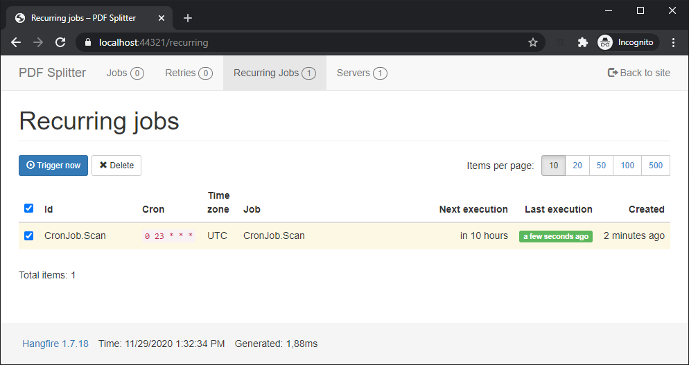
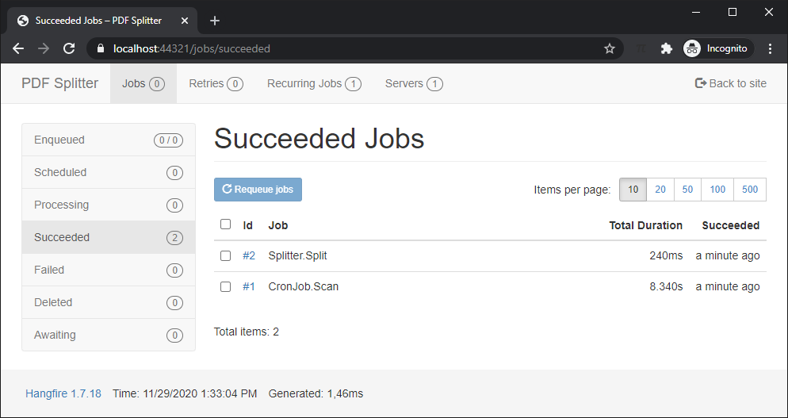
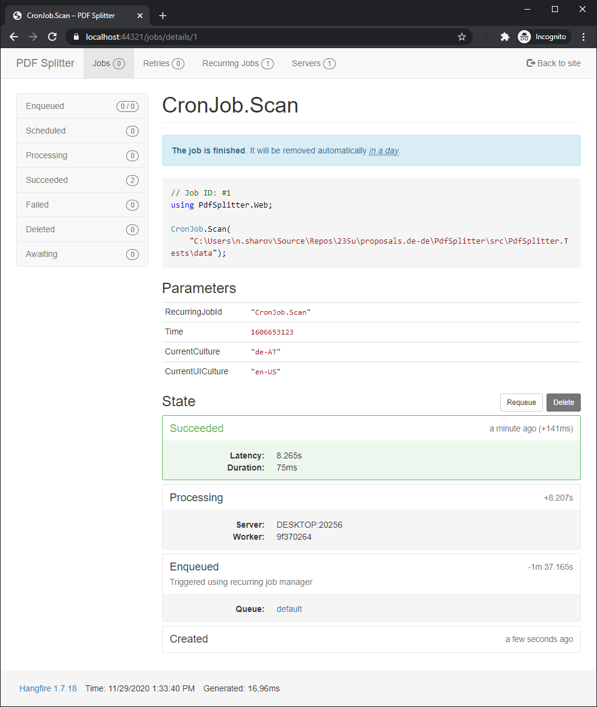
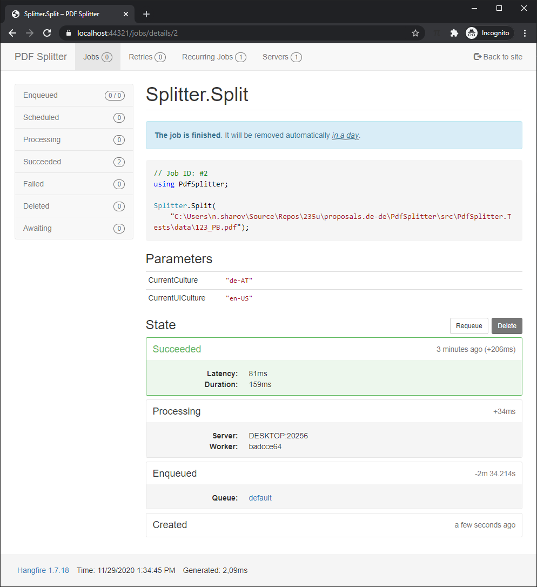

# Automatisches PDF-Splitting

S. https://www.twago.de/project/automatisches-pdf-splitting/163969/

## Umsetzung

`appsettings.json`

```json
{
  "DailyCronJob": {
    "Hour": 23,
    "Minute": 0,
    "DirectoryPath": "..\\PdfSplitter.Tests\\data"
  }
}
```







