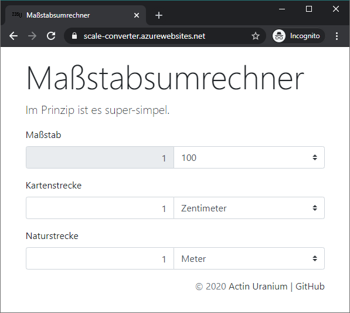

# Maßstabsumrechner

S. https://www.twago.de/project/ma-stabsumrechner/154850/

> Es geht darum einen Maßstabsumrechner tool einzubauen. (Siehe link: https://www.cactus2000.de/de/unit/masssca.shtml). Im prinzip ist es super simpel. Das Design des tools würde ich vorschlagen - mir geht es eher um die Machbarkeitt des Umrechners.

## Prototyp

Live unter: https://scale-converter.azurewebsites.net

